# Elk-Stack-Project
## Automated ELK Stack Deployment

The files in this repository were used to configure the network depicted below.

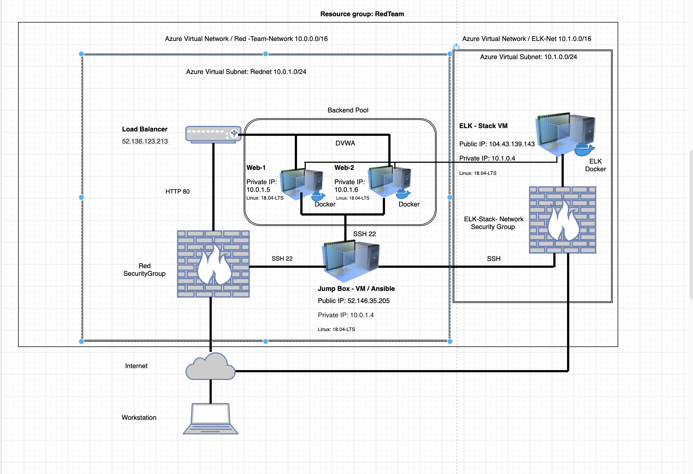

These files have been tested and used to generate a live ELK deployment on Azure. They can be used to either recreate the entire deployment pictured above. Alternatively, select portions of the elk_install.yml file may be used to install only certain pieces of it, such as Filebeat.

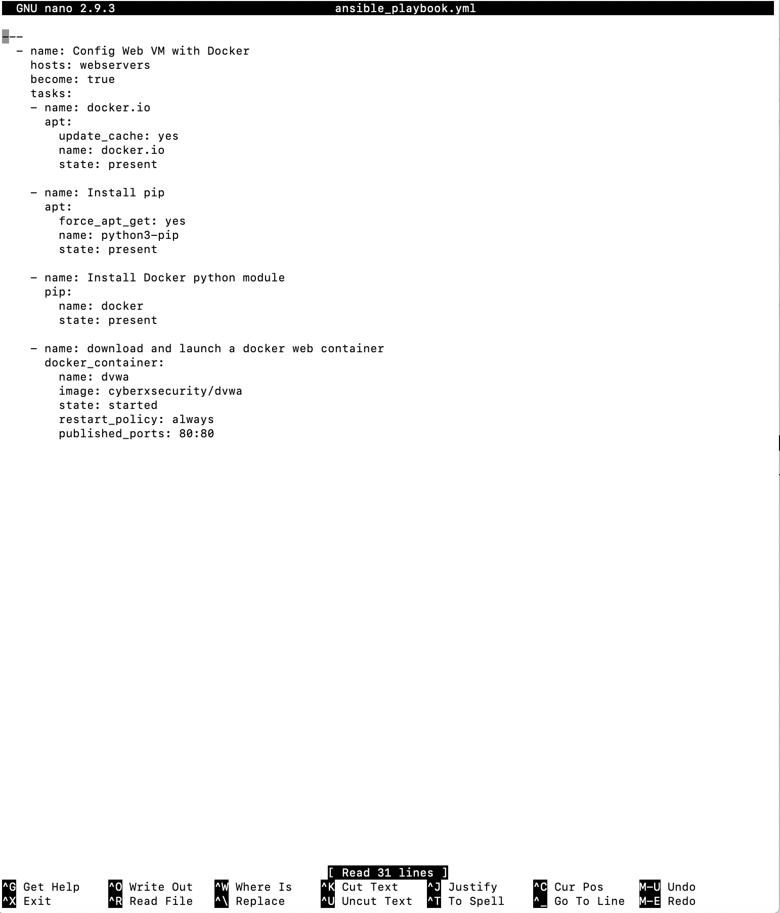

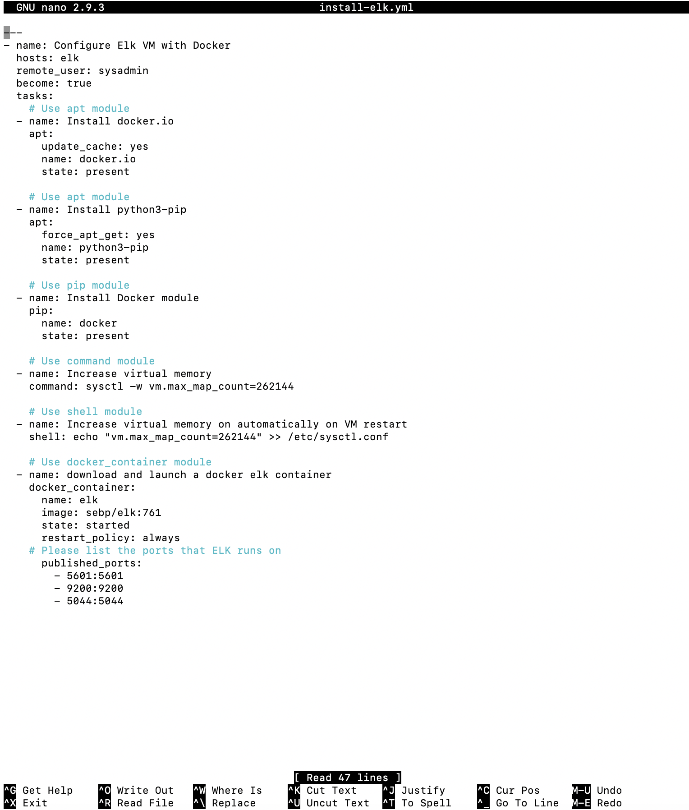

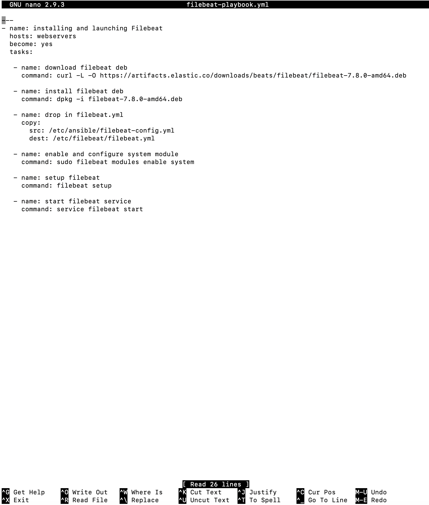

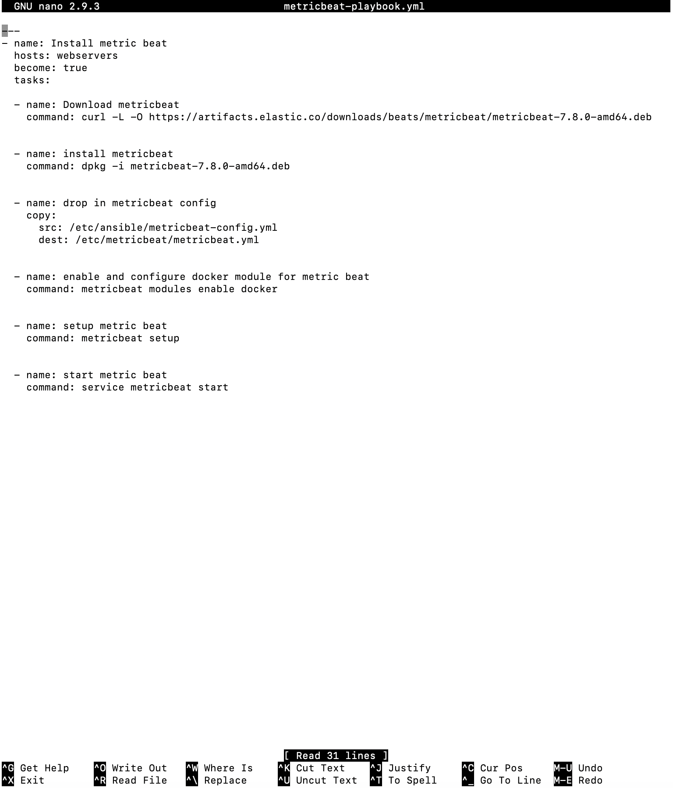

This document contains the following details:
- Description of the Topologu
- Access Policies
- ELK Configuration
  - Beats in Use
  - Machines Being Monitored
- How to Use the Ansible Build

### Description of the Topology

The main purpose of this network is to expose a load-balanced and monitored instance of DVWA, the D*mn Vulnerable Web Application.

Load balancing ensures that the application will be highly redundant and available, in addition to restricting too much demand to the network.

- What aspect of security do load balancers protect? What is the advantage of a jump box?
Load balancers help protect the availability of resources. A load balancer is a network security device that distributes incoming network traffic across multiple servers. A load balancer ensures no single server has to handle too much traffic. If a server receives more resource requests than it can handle, it may go down or fail to handle a resource request.
The jump box sits in front of other machines that are not exposed to the public internet. A jump box is essentially identical to a gateway router. Focusing traffic through a single node makes it easier to implement routing logic and design networks. By focusing on the interactions between the routers instead of all of the machines, we only have to worry about a few connections between a few machines, rather than connections between all machines.

Integrating an ELK server allows users to easily monitor the vulnerable VMs for changes to the file systems and system metric.
- What does Filebeat watch for?
Filebeat collects data about the file system. Filebeat enables analysts to monitor files for suspicious change
- What does Metricbeat record?
Metricbeat collects machine metrics, such as uptime. Metricbeat makes it easy to collect specific information about the machines in the network. 
A metric is simply a measurement about an aspect of a system that tells analysts how "healthy" it is. Common metrics include:
CPU usage: The heavier the load on a machine's CPU, the more likely it is to fail. Analysts often receive alerts when CPU usage gets too high.
Uptime: Uptime is a measure of how long a machine has been on. Servers are generally expected to be available for a certain percentage of the time, so analysts typically track uptime to ensure their deployments meet service-level agreements (SLAs).

The configuration details of each machine may be found below.

| Name      | Function    | IP Address | Operating System |
|-----------|-------------|------------|------------------|
| Jump-Box  | Gateway     | 10.0.1.4   | Linux            |
| Web-1     | Web Servers | 10.0.1.5   | Linux            |
| Web-2     | Web Servers | 10.0.1.6   | Linux            |
| ELK-Stack | Monitoring  | 10.1.0.4   | Linux            |

### Access Policies

The machines on the internal network are not exposed to the public Internet. 

Only the Jump Box machine can accept connections from the Internet. Access to this machine is only allowed from the following IP addresses:
- Jump Box Public IP address: 52.146.35.205. 
Machines within the network can only be accessed by SSH.
- Which machine did you allow to access your ELK VM? What was its IP address?
Web-1 with IP address: 10.0.1.5 and 
Web-2 with IP address: 10.0.1.6

A summary of the access policies in place can be found in the table below.

| Name      | Publicly Accessible | Allowed IP Addresses                                         |
|-----------|---------------------|--------------------------------------------------------------|
| Jump-Box  | Yes                 | Public IP: 52.146.35.205 allowed from my IP: 73.129.159.74   |
| Web-1     | No                  | Private IP: 10.0.1.5 allowed SSH from Jump-Box IP:10.0.1.4   |
| Web-2     | No                  | Private IP: 10.0.1.6 allowed SSH from Jump-Box IP: 10.0.1.4  |
| ELK-Stack | No                  | Private IP: 10.1.0.4 allowed SSH from Jump-Box and localhost |

### Elk Configuration

Ansible was used to automate configuration of the ELK machine. No configuration was performed manually, which is advantageous due to use of playbooks instead of manually installing each individual filebeat or metricbeat.

- What is the main advantage of automating configuration with Ansible?
Ansible container has full access to our VNet and can make a connection with our new VM. Ansible reads YAML code. YAML recursively stands for YAML ain't markup language and is designed to be very readable and easy to write. This further ensures our configurations  will do exactly the same thing every time we run them, by eliminating as much variability between configurations as possible. We use Ansible to configure the VM and install Docker, as well as the web application they will use for testing and training.

The playbook implements the following tasks:
- Creating a New vNet located in the same resource group.
- Creating a New VM to Set up a new virtual machine to run ELK.
- Downloading and Configuring the Container.
- Adding new VM to the Ansible hosts file and creating a new Ansible playbook to use for new ELK virtual machine.
- Launching and Exposing the Container.
- Downloading and running the elk.
- Identifying access management. 

The following screenshot displays the result of running `docker ps` after successfully configuring the ELK instance.

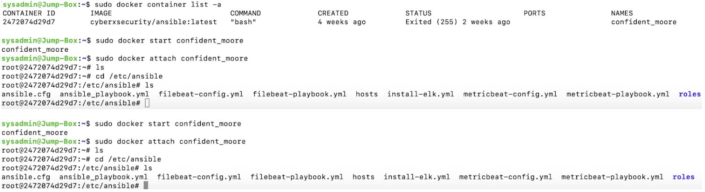

### Target Machines & Beats
This ELK server is configured to monitor the following machines:
List the IP addresses of the machines you are monitoring: 
- Web-1 IP: 10.0.1.5
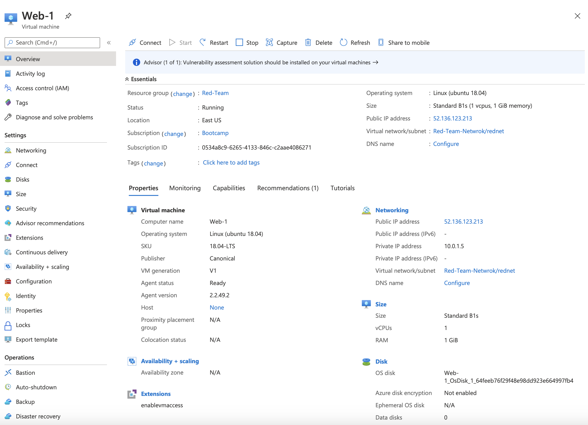

- Web-2 IP: 10.0.1.6

We have installed the following Beats on these machines:
- Specify which Beats you successfully installed:
filebeat and 
metricbeat

These Beats allow us to collect the following information from each machine:
- Filebeat forwards and centralizes log data. Filebeat monitors and collects log files and events and forwards them to Elasticsearch for indexing. We can monitor Syslogs, SSH, sudo commands, new users and groups on our virtual machines. 

- In Kibana we can create index patterns and access metrics directly from the dashboard. In dashboards we can visualize Metricbeat data on dashboards. We have the statistics of running containers as well some data about memory and CPU usage.

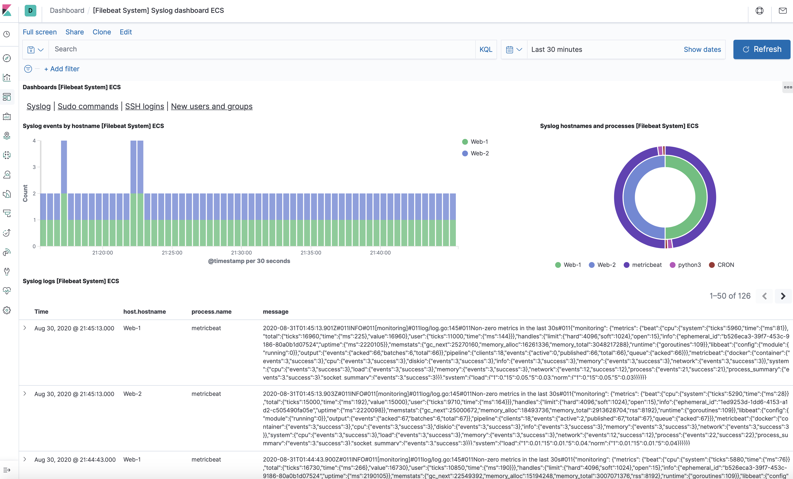

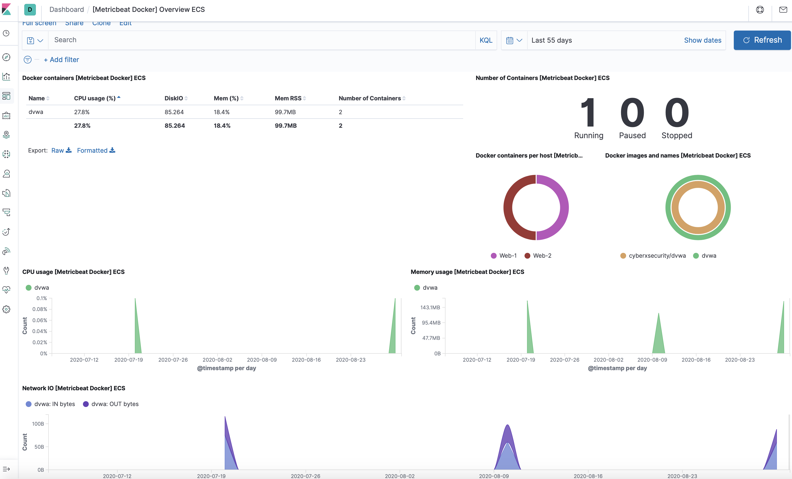

### Using the Playbook
In order to use the playbook, you will need to have an Ansible control node already configured. Assuming you have such a control node provisioned: 

SSH into the control node and follow the steps below:
- Copy the configuration file to container.
- Update the host file to include host IP address.
- Run the playbook, and navigate to Kibana to check that the installation worked as expected.

_Answer the following questions to fill in the blanks:_
- Which file is the playbook? Where do you copy it? 

- ansible_playbook.yml
- filebeat-playbook.yml
- metricbeat-playbook.yml

- _Which file do you update to make Ansible run the playbook on a specific machine? How do I specify which machine to install the ELK server on versus which to install Filebeat on?_

Command: nano hosts
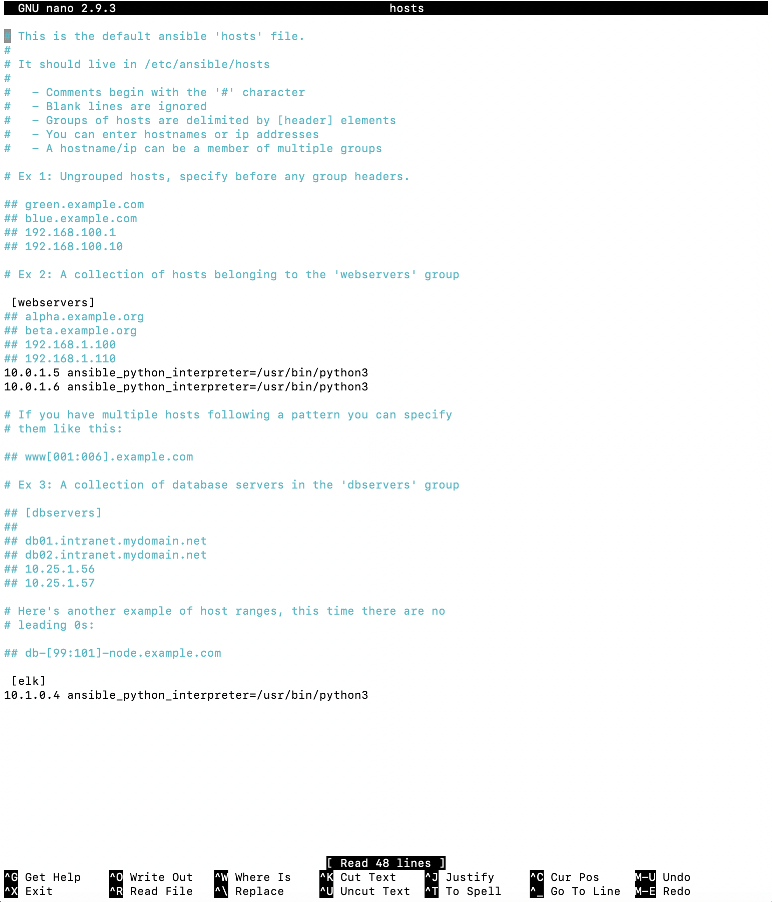

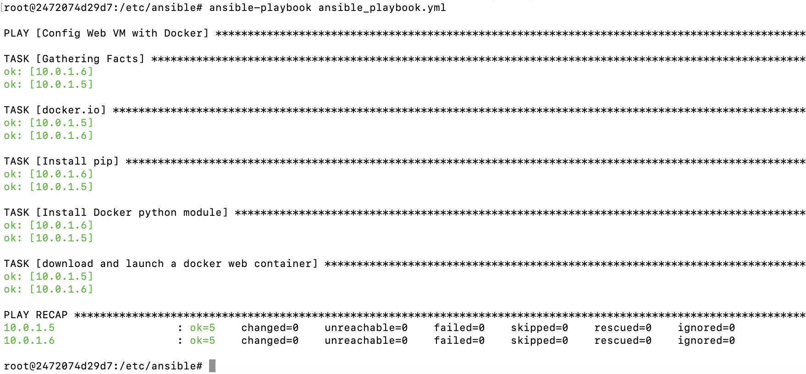

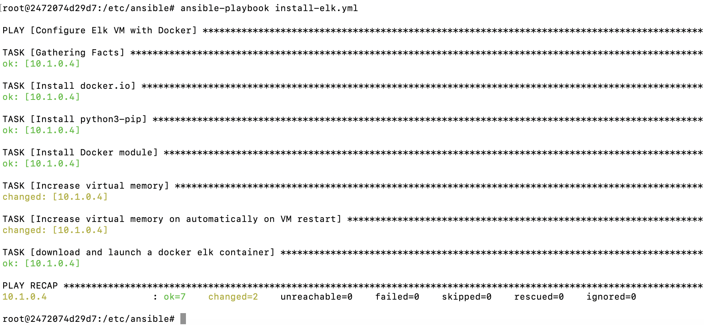

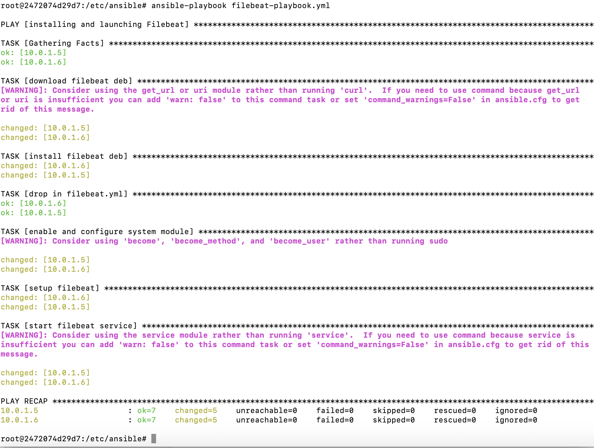

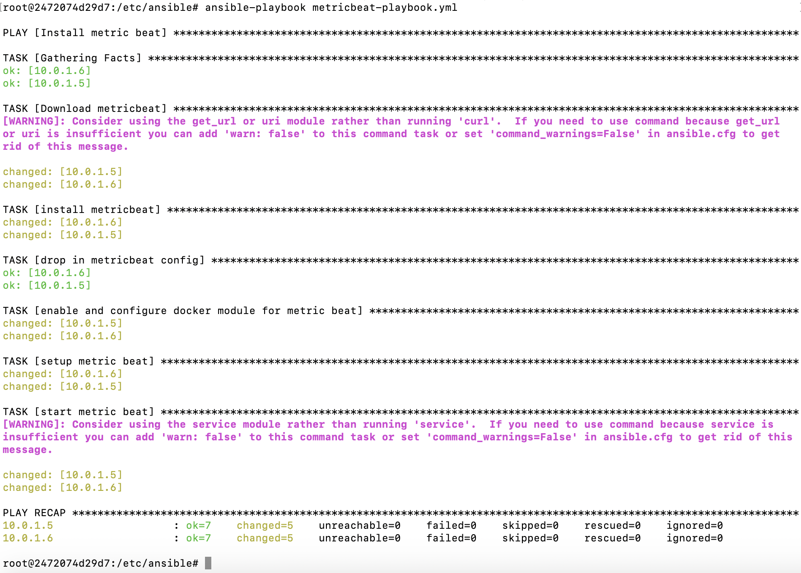

- SSH from Ansible container to ELK machine to verify the connection before running playbook.
- After the ELK container is installed, we SSHed to the container and double check that elk-docker container is running.

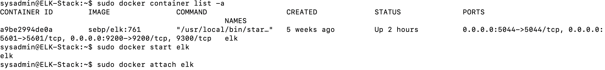

We created a new VM, which used to run your ELK stack. In order to use Ansible to configure this machine, we added it to the list of machines Ansible can discover and connect to. We specified python3 with ansible_python_interpreter=/usr/bin/python3

- /etc/ansible/hosts

[webservers]
_10.0.0.5 ansible_python_interpreter=/usr/bin/python3_
_10.0.0.6 ansible_python_interpreter=/usr/bin/python3_

[elk]
_10.1.0.4 ansible_python_interpreter=/usr/bin/python3_.

Which URL do you navigate to in order to check that the ELK server is running?
- ELK public IP:5601
- http://104.43.139.143:5601/app/kibana#/home

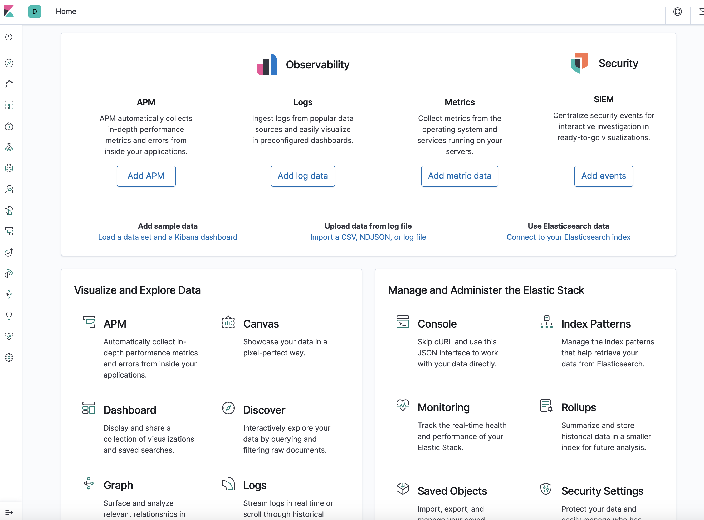

Provide the specific commands the user will need to run to download the playbook, update the files, etc.

# ansible
- Command: nano ansible.cfg
- Command: nano ansible_playbook.yml
- Command: ansible-playbook ansible_playbook.yml

# elk
- Command: nano install-elk.yml
- Command: ansible-playbook install-elk.yml

# filebeat
- Command: nano filebeat-config.yml
- Command: nano filebeat-playbook.yml
- Command: ansible-playbook filebeat-playbook.yml

# metricbeat
- Command: nano metricbeat-config.yml
- Command: nano metricbeat-playbook.yml
- Command: ansible-playbook metricbeat-playbook.yml

